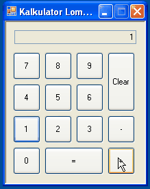

# Tugas Variabel, Tipe Data dan Percabangan

## Soal
Buatlah sebuah aplikasi Kalkulator Lombok yang mendukung operasi penjumlahan dan
pengurangan. Contoh hasil akhir aplikasi **Kalkulator.exe**



## Properties
  - Form
    - FormBorderStyle = Fixed3D
    - MaximizeBox = False
  - TextBox
    - ReadOnly = True
    - RightToLeft = Yes
    - Text = 0

## Petunjuk
- Gunakan select case untuk menangani operasi penambahan atau pengurangan
- Untuk melakukan penggabungan String dapat menggunakan sintaks
```vb
namaTextBox.Text &= "1"
```

## Cara Pengerjaan
- Buka file solution dalam repositori ini, template project menggunakan Visual
  Studio 2010 (Silahkan gunakan menu upgrade jika anda menggunakan versi Visual
  Studio yang lebih baru)
- Ubah file [pernyataan.txt](./pernyataan.txt), isi dengan NIM, nama lengkap serta kelas.
- Kerjakan tugas sesuai dengan deskripsi soal.
- Deadline pengerjaan 10 Oktober 2015 23:59:59 WIB
- Lakukan commit sebelum deadline berakhir, kemudian lakukan sync ke repositori
  remote setelah waktu deadline
- Jika ada pertanyaan silahkan buat isu baru di [Repositori Tugas](https://github.com/polinema-gui/tugas)
